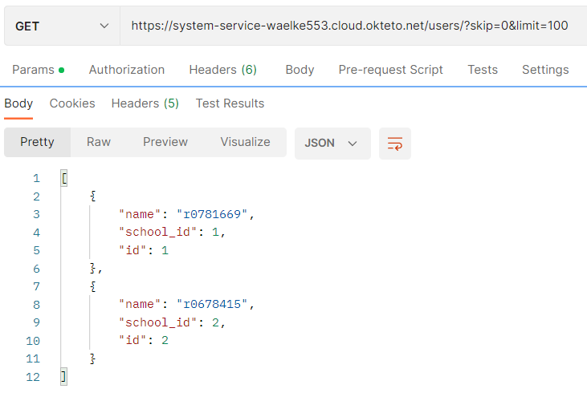
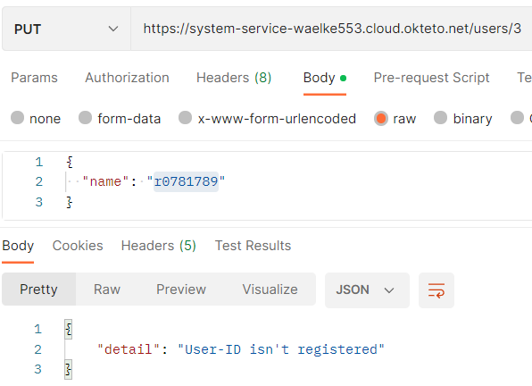

# api_eindproject

Voor mijn eindproject heb ik gekozen om mijn database rond school te maken. Daarnaast hash ik ook de user zijn wachtwoorden. De inpiratie kwam van mijn vorig project hierbij had ik al iets gemaakt rond user's en website's. Maar nu heb ik het thema rond scholen gemaakt en de user's die erin zitten.

# Project inhoud

In mijn project heb ik 3 tabellen "Land tabel, School tabel en een User tabel". Hierbij is de logica dat je eerst een land moet aanmaken via de API. Daarna maak je een school aan via de land ID mee te geven. En als laatste kan je een user aanmaken door de school ID mee te geven.
En daarna kan je zoveel user toevoegen aan een school.

Voor mijn API ik alle 3 de parameters gebruikt "path, querie, body". mijn GET API's zijn meestal path/querie parameters. En mijn POST API's zijn met body parameters mee geleverd. Als laatste heb ik ook een PUT API die de user zijn R-nummer kan veranderen naar een andere. Doordat je de juiste user-ID mee geeft in het path. Daarnaast heb ik ook een DELETE API die een user zal deleten door de juiste user-ID mee te geven in het path.

Voor de Front-END heb ik gekozen om alleen mijn GET en POST API's op te zetten. Voor de PUT en DELETE api zal je postmen moeten gebruiken.
Ik heb ook gitlab gebruikt om mijn html-website te hosten. (Zie foto)

# Python bibliotheken

Python-bibliotheken die ik voor dit project heb gebruikt, worden hieronder weergegeven.

1. Sqlalchemy
2. Passlib
3. Os
4. Fastapi
5. Pydantic

Ik heb "sqlalchemy" gebruikt om tabellen te creeren en informatie te inserten en verwijderen. Ik gebruik "passlib" om de user zijn passwoorden te encrypteren naar de database toe. "Os" wordt gebruikt om een directory op het systeem aan te maken als het nog niet bestond. "Fastapi" wordt gebruikt om een api te maken. Ik heb "pydantic" gebruikt om klassen te maken met het basismodel.

# Soorten API's

Voor dit project heb ik in totaal 11 API's waarvan je 9 API's via de front-end kan berijken. En de andere 3 API's zal je via postman moeten gebruiken. Van de 11 API's zijn er 6 GET API's en 3 POST API's en de laatste 2 zijn een PUT en DELETE API.

Nu zal ik alle API's laten zien via FastAPI/docs en Postman en ten slotte ook via de Front-END.

### FastAPI docs foto

Hier kan u al mijn API's zien via de FastAPI docs.

### Postman foto's

API - Post Method - Land Creëren

API - Post Method - Land Dupliceren

API - Post Method - School Creëren

API - Post Method - School Dupliceren

API - Post Method - User Creëren

API - Post Method - User Dupliceren

API - GET/PUT/DELETE Method - Check user, Change user, Delete user, Check user again

API - GET Methed - Check alle users

API - GET Methed - Check specific users

API - GET Methed - Check alle landen

API - GET Methed - Check specific users

API - GET Methed - Check all scholen

API - GET Methed - Check specific school

API - PUT/DELETE Method - User bestaat niet

### Front-end foto's

Front-end - API calls gemaakt waarvan de post method niet inorde was

Front-end - API calls gemaakt waarvan alles inorde is.

# Punten

1. ❔ ALGEMENE EISEN & DOCUMENTATIE (alles samen +50%)
* Minstens 3 GET, 1 POST, 1 PUT en 1 DELETE endpoints
* Minstens 3 entiteiten in je API via een SQLite databank
* Minstens hashing en OAuth implementeren
* Beschrijving van het gekozen thema, je API(s) en je uitbreidingen + link naar de zaken die hosted zijn op GitHub README.md
* Aantoonbare werking totale API door screenshots van Postman requests op GitHub README.md
* Volledige OpenAPI docs screenshot(s) op GitHub README.md
* Logisch gebruik van path parameters, query parameters en body
* Docker container voor de API(s), welke automatisch door GitHub Actions opgebouwd wordt
* Deployment van de API container(s) op Okteto Cloud via Docker Compose

3. 📳 AANVULLINGEN: FRONT-END
* 3.1 (+15%) Maak een front-end voor je applicatie die al je GET endpoints en POST endpoints bevat.
* 3.1.2 (+10%) Geef de front-end een leuke stijlgeving.

# URL Links

Github Repository: Hier zit u op  
Github Repository voor front-end: [GitHub Repo - Front-end Link](https://github.com/waelke553/api_eindproject_website)  
Hosted API: [Okteto - Hosted API Link](https://system-service-waelke553.cloud.okteto.net/)  
Hosted front-end: [Github - Hosted Front-end Link](https://waelke553.github.io/ api_basisproject_website/)  

Bijkomende commentaar, aanvullingen, enz:

Bij mijn front-end kan je zien dat als je de invoervelden invult. Dat je de link gewoon met het blote oog kunt zien. Ook als is je wachtwoord met bolletjes is dit niet bij de link.

Typ dus NIET uw gebruikte wachtwoorden!

Daarnaast als je de invoer velden van de GET API's leeg laat. Zal hij niet een specifieke user opvragen maar zal hij alles laten zien.
